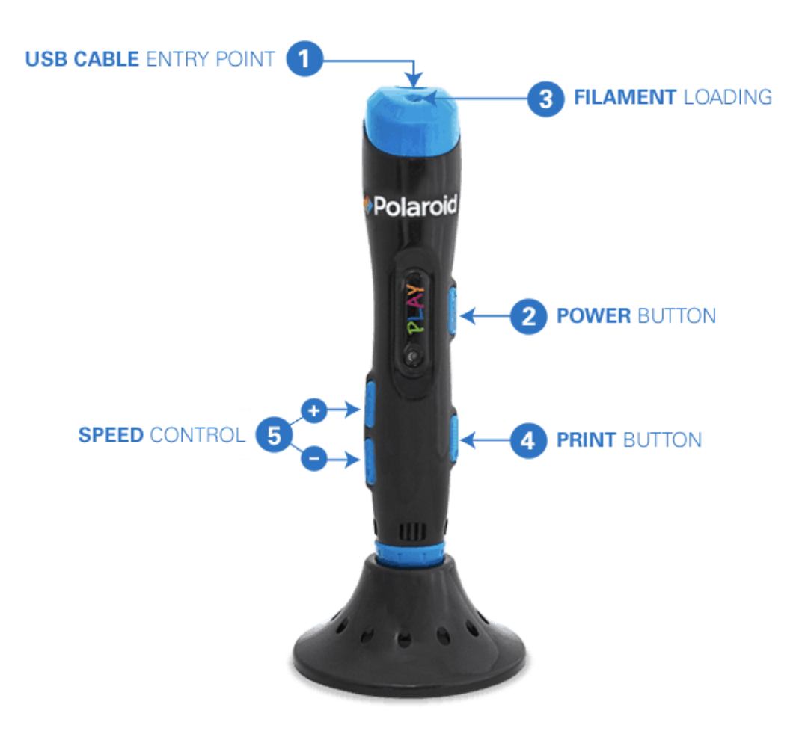

# 3d pens

This is a Polaroid Play 3d pen.

You are going to learn to draw with it.

## How it works

An engineer wants to know how things work.

Source: [https://3dpenhub.com/3d-pens-how-do-they-work/](https://3dpenhub.com/3d-pens-how-do-they-work/)

Drawing with a 3d pen is not easy, and it will take practice. Whenever you are trying to learn, please be patient with it and with yourselves.

### WARNING

**Never** touch the nozzle or the plastic near the nozzle. **It is hot and could burn you.**

Look at your pen:
* On button, also off
* Extrude button, also retract
* Plastic goes in the top and comes out of the nozzle when it melts.
* It takes a few seconds to solidify, but then it is strong.
* It is magical engineering!

## Let's get started

The gears that push the plastic through the pen use a motor that needs electricity to turn. So, now is the time to plug it in to your computer, via the usb cord. Everybody got theirs plugged in?

We need to load in the PLA filament, and to do that the pen needs to be turned on and warmed up. When the light is red, it's heating up. When it's blue, it's ready to go.

Make sure you've got a sharp end of your filament, make sure it's not been previously melted. If it has a melted end, get a grown up to cut the end with a pair of scissors.

Because this is melting plastic, you need to melt it onto a surface that you can remove it from. If you melt the plastic onto paper, the plastic will bond with the paper, like glue, and your creation will not come off easily.

* Practice the squiggling! [Stencil from 3D Doodler](https://learn.the3doodler.com/stencils/lettering-practice/)

Now that you've had a little bit of practice, try doing the first letter of your name, or even your whole name. Tip: do the outline of the letter first, then fill in using "lawnmower lines".

## End of session 1

[Session list](../session_list)
