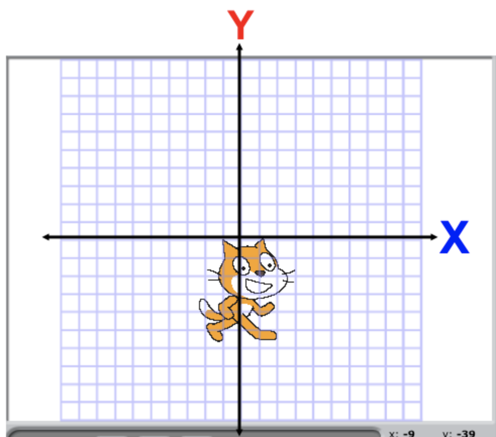

# Session 2: 2D and 3D

## What do we mean by three dimensional?

### 2D grid (X is short, Y has the long tail)

### 3D grid

## From 2D to 3D

The idea behind 3D printing and 3D modelling, is that you can break down a complex 3D object into 2D shapes. You can make 3D from 2D.

Look at your name boards. You were transforming 2D into 3D from the first minute you were in this room!

### Cube nets

Make them yourself here: [http://www.cubefold-craft.com/star-wars-series](http://www.cubefold-craft.com/star-wars-series)

These Star Wars paper crafts show you how big, bold, blocky shapes on the page translate well into 3D.

## 2D shapes in real life

Sometimes, if you look closely, you can see that a three-dimensional thing is made up of two-dimensional things at different angles.

https://en.wikipedia.org/wiki/Suspension_bridge

# [Onwards](001a_tinkercad_introduction.md)
