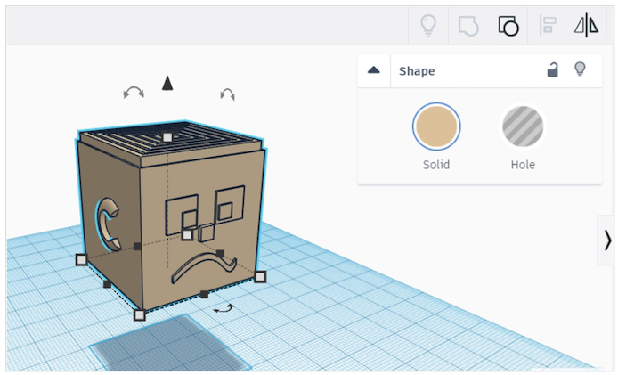
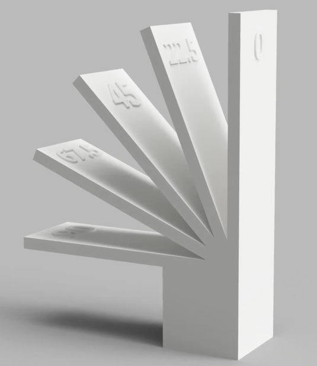
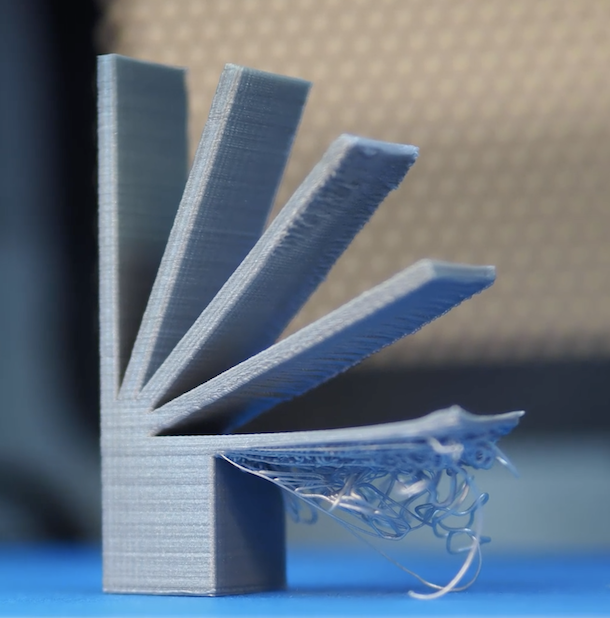
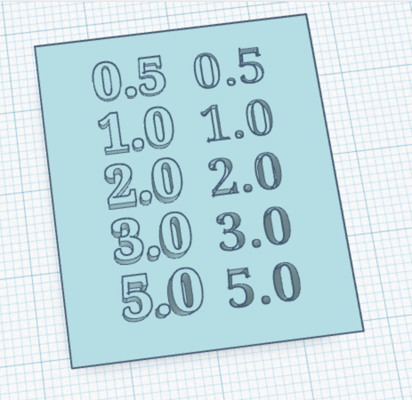
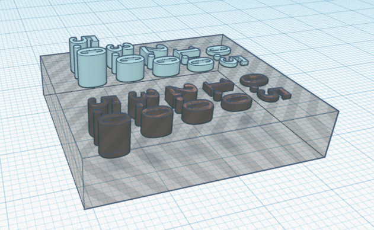
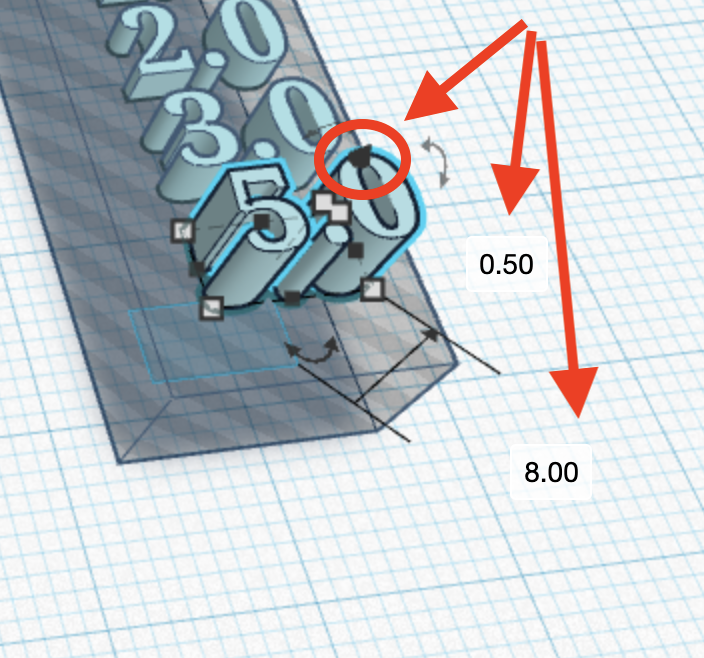

# Session 5: From your mind to a 3D printer

Today is the day that you will create your file for 3D printing. You must complete your file by the end of this session, so that you can hold it in your hands during session 6.

## Preparing your file for printing

* Connect your shapes
* Angles and supports
* Rock solid base
* The ins and outs of emboss and deboss

### Connect your shapes

No floating heads! All your individual shapes must connect or even overlap, so that they are joined together in your print.

If you remember the "additive manufacturing", the printed is going to go layer by layer, and if there is an empty layer between your neck and your head, your head is going to fall off.

Check carefully from all angles to make sure there are no gaps between your body and your arms, legs, head -- even check your eyeballs!

### Angles and supports

Back to "additive manufacturing" layer by layer. If your layer is flat and vertical, the printer can handle it, but angles can be tricky. Something like a 90 degrees right angle up off the surface of the printer bed will dribble because the printer doesn't have anything solid to layer on top of.

 

If you need shapes at angles, 3D printer software can automatically add supports for shapes at an angle. It's calculating angles and then creating a tree-like support system that will get broken off after the print is complete.

### Rock solid base

When you used the 3D pens, sometimes the extruded filament didn't stick to the surface after you moved your pen away. This can happen to a 3D print, if there isn't a substantial enough base to print from.

See the MewTwo above -- it's not build on just feet. The base is there to give it strength and structure.

If your character has dainty feet, consider adding a base.

### The ins and outs of emboss and deboss

Who's da boss?

**Emboss = sticking out**
**Deboss = going in**

You want to be precise and proportional about how far your shapes will stick out (emboss) and how far they will stick in (deboss).

Tinkercad allows you to be very precise, if you use your workplane and the Z axis tool that is shaped like a cone.

## The Big One

Now it's time to build your character in Tinkercad!

This could also be the project gets 3D printed, so take your time and use all the skills you've learned to bring your character to life.

* Tinkercad your characters - 45 minutes

[Session list](../session_list)
